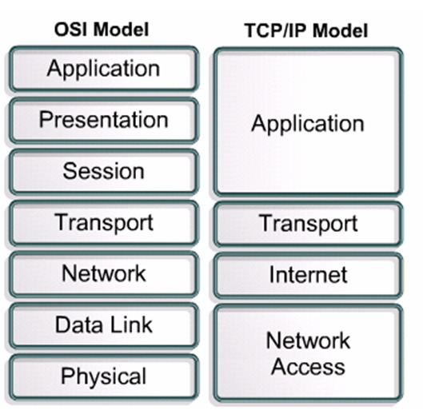

# OSI 7 계층

> Please Do Not Throw Sausage Pizza Away.

### 물리 계층
물리 계층은 실제 장치들을 연결하기 위해 필요한 전기적, 물리적 세부 사항을 정의한다.  
데이터 링크 계층의 프레임을 받고, 구리나 광섬유(케이블) 또는 무선 통신 매체를 통신해 전송하기 위한 
신호로 바꾼다. 
- 데이터 전송 단위 : 비트
- 프로토콜 : RS-232, RE-499 등 케이블

### 데이터 링크 계층
네트워크 계층의 패킷 데이터를 물리적 매체에 실어 보내기 위한 계층 
데이터 링크 계층은 물리적인 네트워크 사이의 데이터 전송을 담당한다. 
가장 중요한 목적은 물리적인 장비를 식별하는 데 사용되는 주소 지정 체계와 데이터가 변조되지 않았음을 확증하기 위한 
오류확인을 제공하는 것이다. 
- 데이터 전송 단위 : 프레임
- 프로토콜 : 이더넷, ... 

### 네트워크 계층
물리적인 네트워크 사이의 라우팅을 담당, 패킷의 이동경로를 결정한다.  
상위 레벨 데이터를 패킷 안으로 캡슐화하여 데이터 종류에 상관없이 한 호스트에서 다른 호스트로 그 패킷들을 라우팅 한다.
데이터는 패킷 안으로 캡슐화 되며, 패킷 헤더는 패킷의 송신지와 수신지 주소들을 포함하는 필드를 가진다. 
네트워크 계층은 네트워크 호스트의 논리적인 주소(ip 등)를 관리하고 
패킷을 분할하여 프로토콜을 식별하는 기능, 오류 탐지 같은 몇 가지 기능을 담당한다.
- 데이터 전송 단위 : 패킷
- 프로토콜 : IP, ARP, ...

### 전송 계층
헤더에 송수신지 포트번호를 포함하여 올바르게 전달 될 수 있게 하는 계층 
전송계층의 가장 중요한 목적은 하위 계층에 신뢰성있는 데이터를 전송할 수 있게 하는 것이다. 
전송방식을 결정한다. 
- 데이터 전송 단위 : TCP - Segment, UDP - Datagram
- 프로토콜 : TCP, UDP

### 세션 계층
통신 세션을 구성하는 계층으로, 포트(port) 연결이라고도 할 수 있다.  
네트워크 상에서 통신을 할 경우 양쪽 host 간에 최초 연결이 되게 하고 통신 중 연결이 끊어지지 않도록 유지시켜주는 역할을 하는 계층 
즉 통신을 하는 두 host 사이에서 세션을 열고 닫고 관리하는 기능을 담당한다. 
- 데이터 전송 단위 : 메시지
- 프로토콜 : SSH, TLS

### 표현 계층
전송하는 데이터의 format을 결정하는 계층  
응용계층으로부터 받은 데이터를 하위 계층인 세션 계층에 보내기 전 통신에 적당한 형태로 변환한다.  
세션계층에서 받은 데이터는 응용 계층에 맞게 변환한다. 
코드 변환, 구문 검색, 데이터 압축, 암호화 등의 기능을 수핸한다. 
-> ASCII, JPEG

### 응용 계층
사용자 인터페이스의 역할을 담당하는 계층  
서비스를 제공한다. 사용자들이 이용하는 네트워크 응용프로그램이다. 사용자와 가장 가까운 프로토콜을 정의한다.  
-> HTTP(80), SMTP(25)

